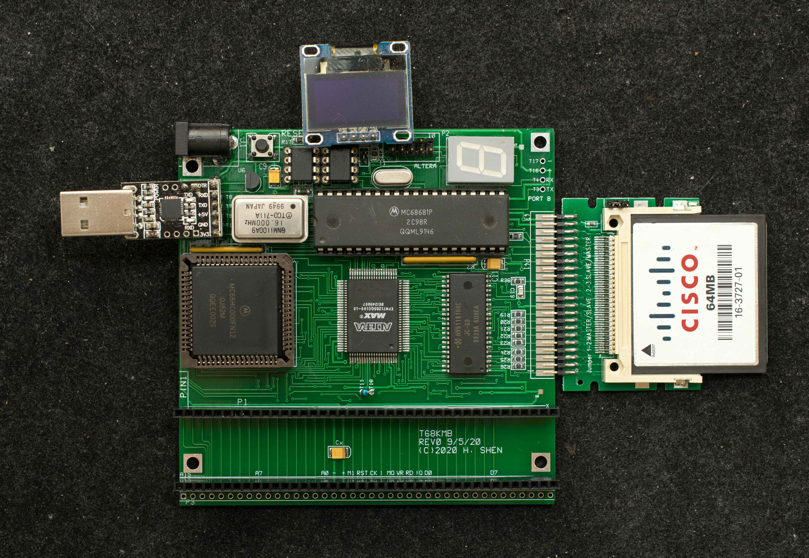
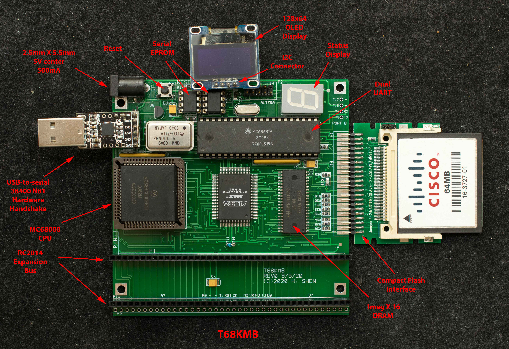

# T68KMB
T68KMB is T68KRC with 3 RC2014 expansion busses added. It is software compatible with T68KRC.

### Features
- Motorola 68000 CPU
- MC68681 DUART, port A is the console operating at 38400 baud, 8N1, with CTS/RTS hardware handshake.
- Altera EPM7128 CPLD contains the glue logic:
  - State machine to load 32K serial flash when powered up or with a reset,
  - DRAM controller for the 2-megabyte DRAM,
  - Hidden CAS-before-RAS refresh in hardware, no software overhead required,
  - memory decoder,
  - Interrupt controller,
  - Bus Error watchdog timer,
- 8-16 MHz oscillator
- 32Kbyte serial flash, 24C256 as the boot device.
- Second 32K serial flash that can be programmed in-situ and serves as the alternate boot device with just one jumper change.
- 44-pin edge connector interfaces to a low-cost IDE-CF module
- HY5118164 1Mx16 DRAM
- I/O expansion port compatible with RC2014 I/O bus interface.
- 7-segment LED display as visual indicator of board operations.
- Three RC2014 expansion busses
- I2C connector for 128×64 OLED display
- Target for CP/M-68K ver 1.3
- 102mm x 102mm 2-layer pc board

### Description
T68KMB has the same design approach as T68KRC. Refer to [T68KRC Description](https://github.com/Plasmode/T68KRC/tree/master/T68KRC_REV0.1) section for more details.

### Design Information
- Schematic
- [Gerber photoplots](t68kmb_rev0_gerber.zip)
- [CPLD design files](t68krc_rev01_cpld_design_files.zip)

### Software
T68KMB software is compatible to T68KRC. Please refer to [software section of T68KRC](https://github.com/Plasmode/T68KRC/tree/master/T68KRC_REV0.1).
